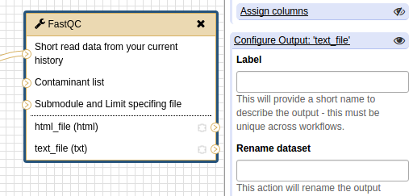
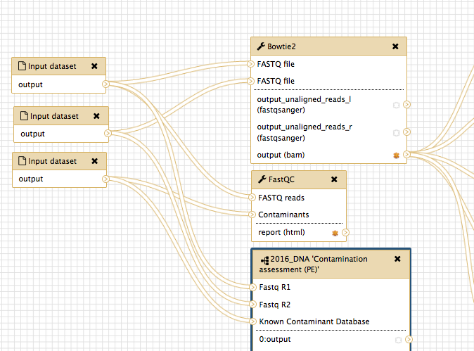

layout: true
class: inverse, middle

---
class: title
# Planemo
## A Scientific Workflow SDK
John Chilton, Aysam Guerler, and the Galaxy Team


The Slides @ http://bit.ly/bosc2016

The Twitters `#usegalaxy` `#commonwl` `@jmchilton`

???

Oh look, I get to follow Björn again - that doesn't seem fair to me.

Compounding that problem - my slides are just the same as last years 
Galaxy Tool SDK find and replace Galaxy tool with scientific workflow.

---
class: larger

### A Galaxy Philosophy

* The most important Galaxy user is the *bench scientist* using the GUI, they come first!
  * .smaller[No one wants to inconvenience a bioinformatician or developer, but we will if absolutely required for the biologist.]
* Galaxy workflows will *never require an SDK*.
  * .smaller[Planemo, workflow formats, etc... are conveniences for people who prefer developer processes.]

???

I'm going to get in trouble from a couple different sides with this talk, and I will state some strong, personal opinions. So I'm going to start with something that amounts to either a justification or a reassurance.

I'm pretty confident this amounts to a Galaxy team perspective - regardless
of how your define that team.

READ SLIDES

The first part of this talk will cover workflow enhancements from an end
user perspective in some ways though.

---

class: center

### GUI Enhancements - Workflow Editor Form


???

The editor form now uses the same backbone driven MVC components as the
new tool form presented last year.

---

class: center
background-image: url(images/gx_new_run_workflow.png)
background-repeat: no-repeat
background-size: contain
background-position: center

### GUI Enhancements - Workflow Run Form

???

The run workflow form has likewise been overhauled and will be merged soon. This
should allow more dynamic option control when running workflows.

---

class: center

### GUI Enhancements - Labels



???

When reasoning about workflows and connections between steps, persistent and unique 
labels for steps and outputs are important. These are useful in the API and too a 
lesser extent in the GUI today.

A major theme of this presentation is going to be that workflows are programs, they
are a coding artifact. I'm not sure anyone would disagree with me on that - but I 
think the implications may be counter-intuitive at times.

---

class: center, white

### GUI Enhancements - Nested Workflows



Image and workflow thanks to *Brad Langhorst* at New England BioLabs.

???

Workflows are programs, languages describing programs should provide abstractions for
composition. Nesting workflows was one of the most requested feature requests of 
Galaxy and it now supports this.

---

### What About Planemo?

???

Enough screenshots right - when I present people expect to see long command-lines!

---

### Planemo's Success

.pull-left[

It is *the way* to develop Galaxy tools in 2016! Why?

- Artifact-centric - not Galaxy-centric or registry-centric.
- Works with existing developer tools - CLI, Git(hub), CI (Travis).
- Very flexible, easily configurable.
- Well documented with focus on *usage examples*.

It is about **developer processes**.
]

.pull-right[


]

???

In 2014, Greg von Kuster presented a tool development workflow that involved 
publishing things to a local tool shed and running tests from there and viewing
the results through the web interface. I call this registry or shed centric tool
development (development activities "boot strap the tool shed, upload to the tool 
shed, run tests against the tool shed, view results in the tool shed, export capsule
from the tool shed". Prior to that tool development was Galaxy-centric - "download 
Galaxy, update the Galaxy tool conf, update the Galaxy test data, run the Galaxy 
tests." Planemo is tool centric - lint the tool, test the tool, serve the tool.

---

class: bottom
background-image: url(images/organic_mower_wat.jpg)
background: #FFFFFF
background-repeat: no-repeat

.photo-credit[Photo Credit:

*Peter Smith (@skwiot)*]

---

class: larger

### Workflows are Programs

When I write programs...

* ... I write *tests* (and write them first)!
* ... I commit them to *Github*!
* ... use a text editor - *my* text editor!

???

The hippest, artisinal, free range text editor of my choice. It is a go 
lang rewrite of a node rewrite of an Erlang editor from 1987 - it is super hot right
now but I'm sure you've never heard of.

---
class: large

### Workflow Operations with Planemo


Serve them:

```
$ planemo serve <workflow.ga>
```

Brings up Galaxy interface with the workflow loaded, install shed 
tools as needed.

???

TODO: Install tool shed tools in .ga files, works for format 2 workflows.

---
class: large

### Load up local tools!

Serve them with tools...

```
$ planemo s --extra_tools <tool_dir>
            <workflow.ga>
```

Supply as many tools as you want.

---
class: larger

### Workflows are harder to serve than tools

* Longer to setup input data
* Takes time to install shed tools
* `sqlite` database locks
* Cluster access is more important

---
class: large

### Planemo Profiles

Profile - a *persistent*, named Galaxy configuration available for serving, running
and testing across workflow invocations.

```
$ planemo profile_create <name>
$ planemo serve --profile <name> <workflow.ga>
```

---
class: large

### Planemo Profiles and Postgres

```
$ planemo profile_create --postgres <name>
$ planemo serve --profile <name> <workflow.ga>
```

Automatically *provision a postgres database* and configure this profile to use it. All
future `serve`, `run`, and `test` invocations using this profile will use this 
database.

???

Makes some reasonable guesses, but Postgres connection settings can be configured with
additional CLI options or in `~/.planemo.yml`.

---
class: large

### Planemo Profiles and Clusters

```
$ planemo profile_create --job_conf <job_conf.xml>
                         <name>
```

Setup a job configuration object for this profile and use it with all future
`serve`, `run`, and `test` invocations using this profile.

???

TODO: Implement slurm.

---
class: large

### Planemo Docker Profiles

Or just...

.slightly-smaller[```
$ planemo profile_create --engine_type docker_galaxy
                         <name>
```
]

Leverage the `docker-galaxy-stable` project spearheaded by the 
Björn Grüning to `serve` and `run` using Galaxy in a Docker container.

This container comes pre-configured with slurm and Postgres as available locally -
but offers lots of additionals goodies such as Condor, ProFTP, supervisor, and uwsgi.

https://github.com/bgruening/docker-galaxy-stable

???

Leverage the omnipresent `docker-galaxy-stable` community project spearheaded by the 
omnipresent Björn Grüning to `serve` and `run` using Galaxy in a Docker container.


---
class: large

### Galaxy Workflow Format

Doesn't Galaxy have a JSON workflow format?

.code[```json
"tool_state": "{\"__page__\": 0, \"__rerun_remap_job_id__\": null,
\"input1\": \"null\", \"chromInfo\": \"\\\"/home/john/workspace/galaxy-central/tool-data/shared/ucsc/chrom/?.len\\\"\",
\"queries\": \"[{\\\"input2\\\": null, \\\"__index__\\\": 0}]\"}",
```]

- Neither human writable, nor human readable.
- JSON doesn't allow comments.
  - One shouldn't have to describe a configuration file in JSON,
    let alone write a program in it.

---

class: smaller

### Format 2 Workflows - Example

```yaml
class: GalaxyWorkflow
name: "Test Workflow"
tools:
  - name: text_processing
    owner: bgruening
inputs:
  - id: input1
outputs:
  - id: wf_output_1
    source: sort#outfile
steps:
  - id: sed
    tool_id: tp_sed_tool
    state:
      infile:
        $link: input1
      code: "s/ World//g"
  - id: sort
    tool_id: tp_sort_header_tool
    state:
      infile:
        $link: sed#output
      style: h  #Human readable
```

Inspired by CWL, Michael Crusoe assures me we can use actual CWL workflow definitions 
with Galaxy tool definitions.

---
class: smaller

### Format 2 Workflows - Composition Example

```yaml
class: GalaxyWorkflow
inputs:
  - id: outer_input
steps:
  - tool_id: cat1
    label: first_cat
    state:
      input1: {$link: outer_input}
  - run:
      class: GalaxyWorkflow
      inputs:
        - id: inner_input
      outputs:
        - id: workflow_output
          source: random_lines#out_file1
      steps:
        - tool_id: random_lines1
          label: random_lines
          state:
            num_lines: 1
            input: {$link: inner_input}
            seed_source:
              seed_source_selector: set_seed
              seed: asdf
    label: nested_workflow
    connect:
      inner_input: first_cat#out_file1
  ...
```

---

class: smaller

### Format 2 Workflows - Implicit Connections Example

```yaml
class: GalaxyWorkflow
name: "Indexing Workflow"
inputs:
  - id: fasta
  - id: reads
steps:
  - label: create_index
    tool_id: example_data_manager
    state:
      sequences:
        $link: fasta
  - label: run_mapper
    tool_id: example_mapper
    connect:
      $step: create_index
    state:
      input1:
        $link: reads
```

---
class: large

### Testing Workflows

```
$ planemo test [--profile <name>] <workflow>
```

* Same HTML output and other formatting options as tools.
* Produce sharable test result link with `planemo share_test`.
* Test either Galaxy native or Format 2 workflows.

---
class: large
  
### Generalized Test Format

Test any artifact (Galaxy Tool, Galaxy Workflow, CWL Tool, CWL 
Workflow) - using the same YAML-based format.

If workflow is in file `my_workflow.ga`, place test file named
`my_workflow-test.yml` in the same directory.

```
planemo test my_workflow.ga
```

Will detect this artifact and run the tests.

---

class: large, bottom, white
background-image: url(images/tool_test.png)
background-repeat: no-repeat
background-size: contain

---

```yaml
- doc: Simple test over text tools.
  job:
    input1:
      class: File
      path: hello.txt
  outputs:
    wf_output_1:
      checksum: sha1$2ef7bde608ce5404e97d5f042f95f89f1c232871
    wf_output_2:
      file: output1.txt
      compare: diff
      lines_diff: 2
```

---

class: larger

### Run Workflows

```
$ planemo run <workflow> <job.json>
```

---

class: large, bottom, white
background-image: url(images/CWL-Logo-HD.png)
background-repeat: no-repeat
background-size: contain

---

layout: true
class: inverse, middle

---
class: large

### CWL & Galaxy

*Experimental* tool support today using planemo.

```
$ planemo serve --cwl <tool.cwl>
$ planemo test <tool.cwl>
$ planemo run <tool.cwl> <job.json>
```

When `serve`, `test`, `run` encounter CWL tools they will use a Galaxy fork.

Work in progress at https://github.com/common-workflow-language/galaxy.

---

class: large

### Planemo Engine Type `cwltool`

With `--engine_type=cwltool` (set default in `~/.planemo.yml`), one can
`run` and `test` both CWL tools and workflows.

---

### CWL and `tool_init` (1 / 2)

```shell
$ planemo tool_init --cwl \
                    --id 'seqtk_seq' \
                    --name 'Convert to FASTA (seqtk)' \
                    --example_command \
                        'seqtk seq -a 2.fastq > 2.fasta' \
                    --example_input 2.fastq \
                    --example_output 2.fasta \
                    --container 'dukegcb/seqtk' \
                    --test_case \
                    --help_from_command 'seqtk seq'
```

---

class: smaller

### CWL and `tool_init`  (2 / 2)

.pull-left[
```yaml
#!/usr/bin/env cwl-runner
cwlVersion: 'cwl:draft-3'
class: CommandLineTool
id: "seqtk_seq"
label: "Convert to FASTA (seqtk)"
requirements:
  - class: DockerRequirement
    dockerPull: dukegcb/seqtk
inputs:
  - id: input1
    type: File
    description: TODO
    inputBinding:
      position: 1
      prefix: "-a"
outputs:
  - id: output1
    type: File
    outputBinding:
      glob: out
baseCommand: ["seqtk", "seq"]
arguments: []
stdout: out
description: |
  
  Usage:   seqtk seq [options] <in.fq>|<in.fa>
  ...
```
]

.large[.pull-right[
Generates:
- `seqtk_seq.cwl`
- `seqtk_seq-tests.yml`
- `test-data/2.fasta`
- `test-data/2.fastq`
]]

---

### CWL and `lint`

```
$ planemo l seqtk_seq.cwl
Linting tool /opt/tools/seqtk_seq.cwl
Applying linter general... CHECK
.. CHECK: Tool defines a version [0.0.1].
.. CHECK: Tool defines a name [Convert to FASTA (seqtk)].
.. CHECK: Tool defines an id [seqtk_seq_v3].
Applying linter cwl_validation... CHECK
.. INFO: CWL appears to be valid.
Applying linter docker_image... CHECK
.. INFO: Tool will run in Docker image [dukegcb/seqtk].
Applying linter new_draft... CHECK
.. INFO: Modern CWL version [cwl:draft-3]
```

---
class: large

### CWL and `test`

```
$ planemo t --engine_type=cwltool \
            seqtk_seq.cwl
```

Tool test output HTML is produced in the file `tool_test_output.html`.

---

class: large

### Deployment Matters

- `SoftwareRequirement`s were added to CWL 1.0. [PR #240](https://github.com/common-workflow-language/common-workflow-language/pull/240)
- Can be resolved using Galaxy's dependency resolution framework - [cwltool#93](https://github.com/common-workflow-language/cwltool/pull/93)
  - Conda, homebrew, environment modules, "galaxy packages", etc....


---

class: large, bottom, white
background-image: url(images/mulledflow.png)
background-repeat: no-repeat
background-size: contain

---

class: inverse
background-color: black

### Thanks

.pull-left[
- *Planemo contributors*
- Galaxy team & IUC
- Common Workflow Language group - with special thanks to *Michael Crusoe* and *Peter Amstutz* for working through detailed compromises
- Everyone that has ever built something cool with Planemo or Galaxy workflows
]
.smaller.pull-right[- *Helena Rasche*
- *Martin Cech*
- *Peter Cock*
- *Daniel Blankenberg*
- *Björn Grüning*
- *Dave Bouvier*
- *Kyle Ellrott*
- *Nate Coraor*
- *Dannon Baker*
- *Marius van den Beek*
- *Lance Parsons*
- *Nicola Soranzo*
- *Dannon Baker*
- *James Taylor*
- *Mark Einon*
- *Michael R. Crusoe*
- *Peter van Heusden*
- *Rémi Marenco*
- *Matt Chambers*
- *Gildas Le Corguillé*
- *Nitesh Turaga*
]

---

class: large

### Aside - gxformat2

```
pip install gxformat2
```

`gxformat2` is a Python library for the conversion of "Format 2" workflows.

- Started as a way to build test workflows for Galaxy testing framework.
- All steps can be labeled, connections described by ID.
  - Pypi @ https://pypi.python.org/pypi/gxformat2/
  - Github @ https://github.com/jmchilton/gxformat2

---
class: large

### Another Aside - Ephemeris

```
pip install emphemeris
```

`emphemeris` is an opinionated Python library and scripts for bootstrapping Galaxy tools, index data, and worklows.

- Scripts from `ansible-galaxy-tools` by Marius van den Beek, Enis Afgane, Björn Grüning, and others.
- Pypi @ https://pypi.python.org/pypi/emphemeris/
- Github @ https://github.com/galaxyproject/emphemeris

---
class: large

### Common Workflow Language

* http://www.commonwl.org/
* Group of (and specifications by) engineers
  * Formed at 2014 BOSC Codefest.
  * After 4 draft iterations, 1.0 will be released next week.
* Like Galaxy, the rare open infrastructure that crosses the Atlantic.
  * Adopted by various Elixer efforts, Seven Bridge Genomics,
    and will be implemented in Taverna.
  * Will be supported on all NIH Cancer Cloud Pilots and endorsed by the 
    GA4GH. Reference implementation `cwltool` developed at Curoverse.
